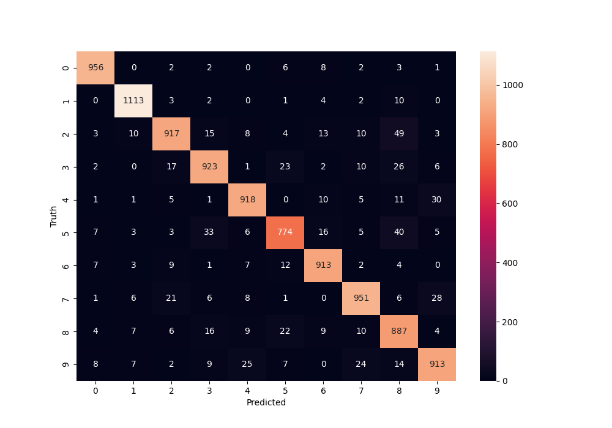
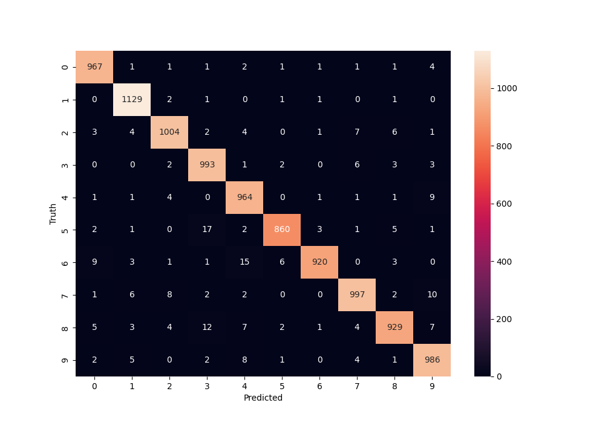

## ✍️ Handwritten Digit Recognition (MNIST)

This project implements deep learning models using TensorFlow/Keras to classify handwritten digits (0–9) from the MNIST dataset.
The goal is to explore different neural network architectures and evaluate their performance.

📊 Dataset

Dataset: [MNIST Handwritten Digits](http://yann.lecun.com/exdb/mnist/)

- Training Samples: 60,000
- Test Samples: 10,000
- Image Size: 28 × 28 grayscale
- Classes: 10 (digits 0–9)


## 🚀 Workflow

Loaded and preprocessed the dataset:

- Normalized pixel values to [0, 1]
- Flattened images for fully connected layers

Implemented different models:

- Simple Dense Model (10 neurons, sigmoid)
- Two-Layer Dense Model (100 ReLU + 10 sigmoid)
- Flatten + Dense Model (100 ReLU + 10 sigmoid)

Compiled models with Adam optimizer and Sparse Categorical Crossentropy loss

Trained models for 5–10 epochs

Evaluated accuracy on the test set

Visualized predictions with confusion matrix heatmaps

## 🧪 Model Evaluation Results

| Model                              | Test Accuracy |
|-----------------------------------|--------------:|
| Dense (10 sigmoid)                 | 92.5%         |
| Dense (100 ReLU → 10 sigmoid)      | 97.5%         |
| Flatten → Dense (100 ReLU → 10 sigmoid) | 97.7%   |

## 📈 Confusion Matrices

1️⃣ Dense (10 sigmoid) — Accuracy: 92.5%


2️⃣ Dense (100 ReLU → 10 sigmoid) — Accuracy: 97.5%


3️⃣ Flatten → Dense (100 ReLU → 10 sigmoid) — Accuracy: 97.7%



## ⚙️ Installation

1. Clone the repo:

```bash
git clone https://github.com/yourusername/CodeAlpha_Handwritten_Digit_Recognition_MNIST.git
cd CodeAlpha_Handwritten_Digit_Recognition_MNIST
```
2. **Install dependencies:**:   
```commandline
pip install -r requirements.txt
```

## 📂 Files in This Repo

mnist_classification.ipynb: Jupyter notebook with preprocessing, training, and evaluation

images/confusion_matrix.png: Heatmap of confusion matrix

requirements.txt: Python dependencies


👨‍💻 Author

Yoseph Negash

📧 yosephn22@gmail.com

📅 2025
